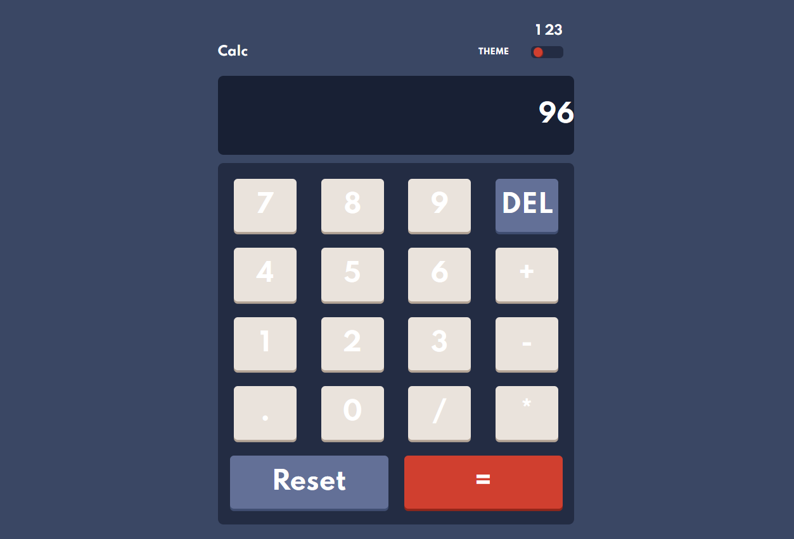
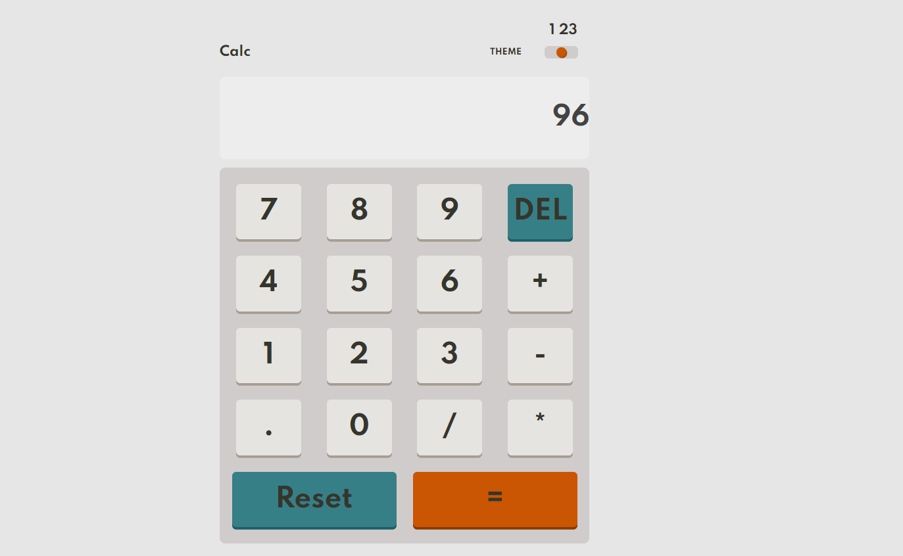
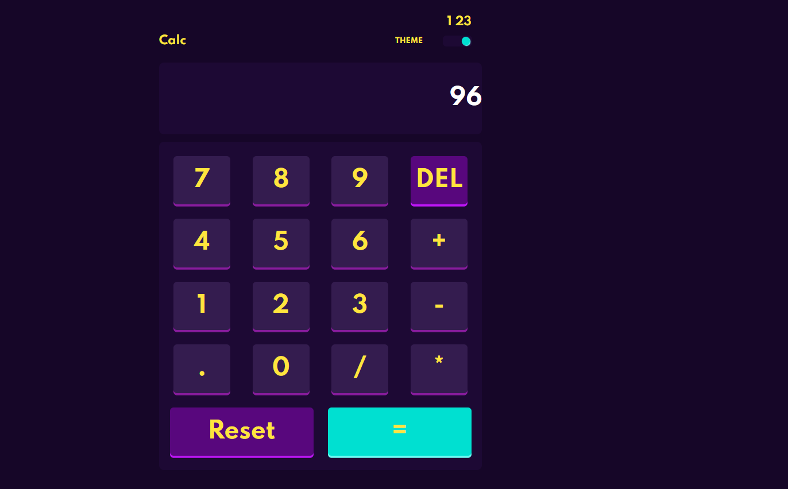

## Table of contents

- [Overview](#overview)
  - [The challenge](#the-challenge)
  - [Screenshot](#screenshot)
  - [Built with](#built-with)
- [Author](#author)

## Overview

### The challenge

Users should be able to:

- See the size of the elements adjust based on their device's screen size
- Perform mathmatical operations like addition, subtraction, multiplication, and division
- Adjust the color theme based on their preference
- **Bonus**: Have their initial theme preference checked using `prefers-color-scheme` and have any additional changes saved in the browser

### Screenshot

### Built with

- Semantic HTML5 markup
- CSS custom properties
- Flexbox
- CSS Grid
- Mobile-first workflow
- JS
## Author

- Website - [Ahmed Nagiub](https://ahmadnagiub.github.io/portfolio/)
- Frontend Mentor - [@AhmadNagiub](https://www.frontendmentor.io/profile/AhmadNagiub)
- linked in - [@ahmed-nagiub33](https://www.linkedin.com/in/ahmed-nagiub33/)
- Live Site - [@Demo](https://ahmadnagiub.github.io/Frontend-Mentor/product-preview-card-component-main/)